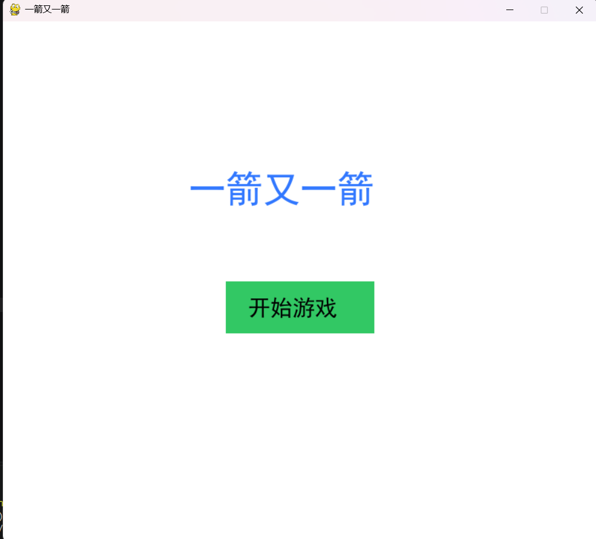
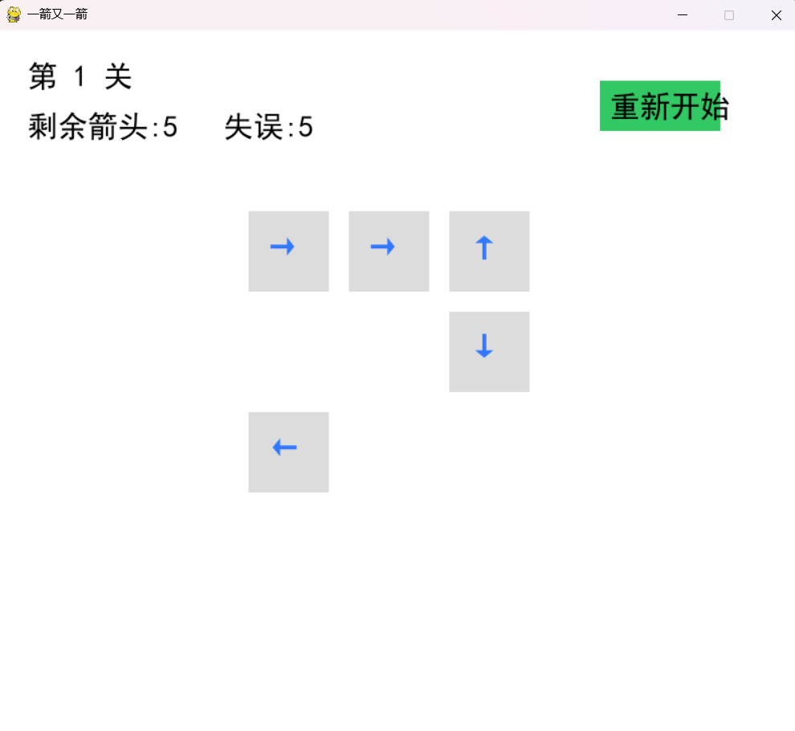
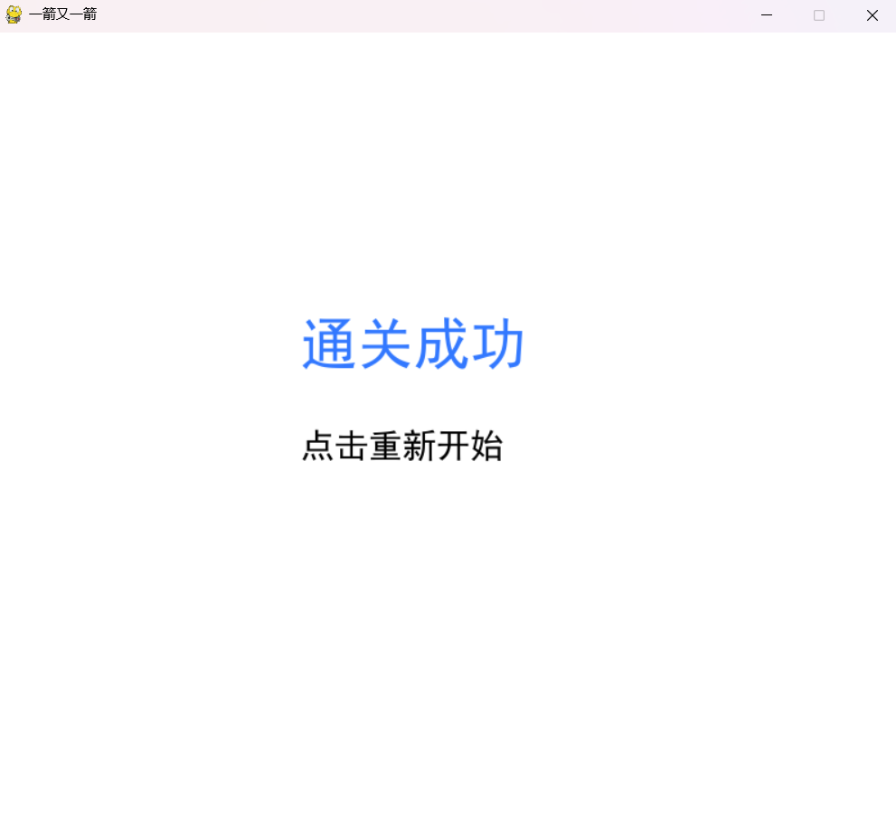
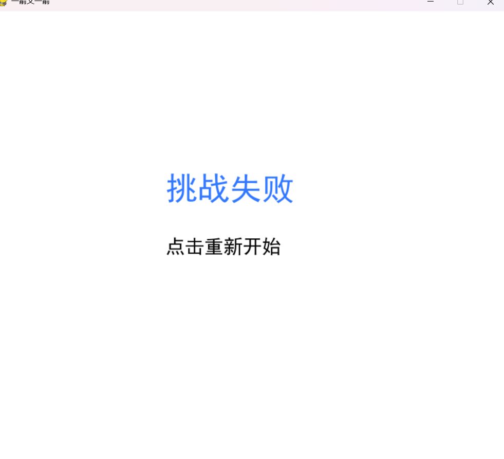

# 一箭又一箭小游戏

## 项目简介

本项目使用 Python 和 Pygame 开发，
实现了一款类似“一箭又一箭”的点击式箭头解谜小游戏。

玩家需要观察箭头方向，
判断箭头前进方向是否存在其他箭头阻挡。

如果没有阻挡，箭头会飞出棋盘并消失；
如果存在阻挡，则触发碰撞反馈，同时减少一次失误机会。

## 开发环境

- Python 3.10
- Pygame
- Visual Studio Code

## 游戏操作

鼠标点击棋盘中的箭头：

- 箭头前方无障碍：
  箭头消失

- 箭头前方存在其他箭头：
  箭头无法移动，并扣除一次失误次数

## 游戏功能

已实现：

- 开始界面
- 游戏界面
- 通关界面
- 失败界面
- 四方向箭头
- 路径检测
- 碰撞反馈
- 三个游戏关卡
- 重新开始功能
## 游戏截图

# 一箭又一箭小游戏

## 开始界面

## 游戏界面

## 通关界面

## 失败界面

